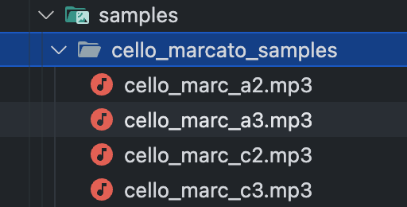

# The LONDON UNDERGROUND PHONY ORCHESTRA (LUPO)

This is a audio/visual generative music app powered by the TfL Unified API and a healthy dose of curiosity.

Data is periodically fetched from the TFL [line API](https://api.tfl.gov.uk/swagger/ui/index.html?url=/swagger/docs/v1#!/Line/Line_Get), and used to schedule the triggering of visual effects on the London Underground tube map, and musical events of different pitches. For the default orchestra setting, arrivals on each line of the tube will trigger a note from a different instrument of the orchestra.

[Tone JS](https://tonejs.github.io/) was used to handle audio functionality. Their Sampler instrument class provides the capability to play the [audio samples included in this repo](./frontend/public/samples)

The decision was made during development to 'spread' out the arrival times of trains, since without doing this, [the data provided by TFL](./sampleData/sample2.json) has train arrivals often 'clumped' together, resulting in long periods of inactivity, and intense bursts of audio and visual triggers simultaneously. Train arrivals are spread in intervals of 250 ms, corresponding to quavers at a tempo of 120bpm in terms of musical notation. [Two](./sampleData/quantisedSample1.json) [examples]((./sampleData/quantisedSample2.json)) of the resulting data are included in the repo.


## To view this app

At time of writing, the app can be viewed online at [lupo.onrender.com](https://lupo.onrender.com/).

## To run this app

### In development
```bash
npm install # to install dependencies
npm start # to start the app
```

### In production

Requires the serve package
```bash
npm install -g serve # to install serve
npm run build # to build the static site
npm serve -s build # to serve the static site on port 3000.
```

You may also use `npm serve` to serve the site on another port, e.g.
```bash
npm serve -s build -l 4000 # to serve the static site on port 4000.
```

## To run Cypress e2e tests

```bash
npx cypress run --spec 'cypress/e2e/landing-page.cy.js' 
npx cypress run --spec 'cypress/e2e/main-page-structure.cy.js'
npx cypress run --spec 'cypress/e2e/navigation.cy.js'
```

## Available Scripts

### `cd frontend`

### `npm start`

Runs the app in the development mode.\
Open [http://localhost:3000](http://localhost:3000) to view it in your browser.

The page will reload when you make changes.\
You may also see any lint errors in the console.

### `npm test`

Launches the test runner in the interactive watch mode.\
See the section about [running tests](https://facebook.github.io/create-react-app/docs/running-tests) for more information.

### `npm run test:unit`

Runs only the cypress component tests (excluding the e2e tests)

### `npm run build`

Builds the app for production to the `build` folder.\
It correctly bundles React in production mode and optimizes the build for the best performance.

The build is minified and the filenames include the hashes.\
Your app is ready to be deployed!

See the section about [deployment](https://facebook.github.io/create-react-app/docs/deployment) for more information.

### `npm run eject`

**Note: this is a one-way operation. Once you `eject`, you can't go back!**

If you aren't satisfied with the build tool and configuration choices, you can `eject` at any time. This command will remove the single build dependency from your project.

Instead, it will copy all the configuration files and the transitive dependencies (webpack, Babel, ESLint, etc) right into your project so you have full control over them. All of the commands except `eject` will still work, but they will point to the copied scripts so you can tweak them. At this point you're on your own.

You don't have to ever use `eject`. The curated feature set is suitable for small and middle deployments, and you shouldn't feel obligated to use this feature. However we understand that this tool wouldn't be useful if you couldn't customize it when you are ready for it.

## Learn More

You can learn more in the [Create React App documentation](https://facebook.github.io/create-react-app/docs/getting-started).

To learn React, check out the [React documentation](https://reactjs.org/).

### Code Splitting

This section has moved here: [https://facebook.github.io/create-react-app/docs/code-splitting](https://facebook.github.io/create-react-app/docs/code-splitting)

### Analyzing the Bundle Size

This section has moved here: [https://facebook.github.io/create-react-app/docs/analyzing-the-bundle-size](https://facebook.github.io/create-react-app/docs/analyzing-the-bundle-size)

### Making a Progressive Web App

This section has moved here: [https://facebook.github.io/create-react-app/docs/making-a-progressive-web-app](https://facebook.github.io/create-react-app/docs/making-a-progressive-web-app)

### Advanced Configuration

This section has moved here: [https://facebook.github.io/create-react-app/docs/advanced-configuration](https://facebook.github.io/create-react-app/docs/advanced-configuration)

### Deployment

This section has moved here: [https://facebook.github.io/create-react-app/docs/deployment](https://facebook.github.io/create-react-app/docs/deployment)

### `npm run build` fails to minify

This section has moved here: [https://facebook.github.io/create-react-app/docs/troubleshooting#npm-run-build-fails-to-minify](https://facebook.github.io/create-react-app/docs/troubleshooting#npm-run-build-fails-to-minify)

## Development notes

### The progression of Sampler creation after initial app project

At the time of the first deployement and the nominal completion of the project, **all** instrument samplers were created when the map section of the app was mounted and then re-created every time the instrument set was changed. Additionally, for the **tube drum** and **marimba** instrument sets, 12 identical samplers were created for each `instrument` (11 lines plus 'pedal') where a single sampler could be assigned to each line and the pedal for the `instrument` object.

The first change was to create a single sampler for the **tube drum** and **marimba** instrument sets.

The next stage was to separate the creation of the samplers from the rest of the `audioSetup` function, and then to return the `samplers` along with `instrument` and pass in into new `state` when the app first mounts. Subsequent changes of the instrument set would not require the re-creation of the smaplers but would simply update the `instrument` object.

Having completed a more efficient way of creating and keeping the samplers which would then not change, the next stage as to refactor the sampler code to be more concise and DRY.

1. The lenghty url assignments were replaced with a `getUrls` function which would return the correct url for the instrument and note.
2. Since the creation of each sampler was very similar, a `createSampler` function was created which would take the arguments required and return a sampler.



Urls reference the samples stored in the `public/samples` directory.


An example of an original sampler creation with manual url assignments.


Three samplers created using the `getUrls` function. This clearly revealed the repetition in the creation of the samplers.


The current `getUrls` and `createSampler` functions currently used to create the samplers.


Current creation of the samplers in the `createSamplers` function called in `audioSetup`.

## Station Name and Line Name usage

**stations.js** contains an array of stations for each line with the stations vaguely in order (runngin west to east) but prioritising line branches over west to east orientation.
The stations are named inconsistently with some having the name of the line that they are on but again quite inconsistently. 
Spaces are absent. 
Ampersands are included